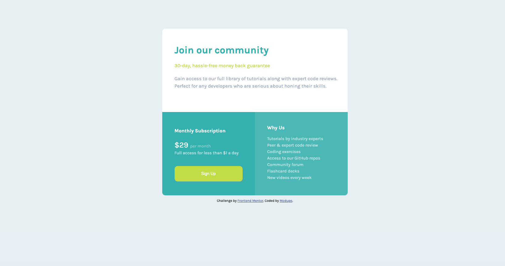

# Frontend Mentor - Four card feature section solution

This is a solution to the [Four card feature section challenge on Frontend Mentor](https://www.frontendmentor.io/challenges/four-card-feature-section-weK1eFYK). Frontend Mentor challenges help you improve your coding skills by building realistic projects.

### The challenge

Users should be able to:

- View the optimal layout for the site depending on their device's screen size

### Screenshot

### Links

- Solution URL: [Check out my solution](https://www.frontendmentor.io/solutions/four-card-feature-section-using-css-grid-and-flexbox-p-rGH20qL)
- Live Site URL: [Check out my live site](https://modu9173.github.io/Four-Card-Feature-Project/)

### Built with
- CSS Grid

### Continued development

Continue to practice using CSS Grids and Flexbox. 

## Author

- Website - [Modupe](https://github.com/Modu9173)
- Frontend Mentor - [@Modu9173](https://www.frontendmentor.io/profile/Modu9173)

